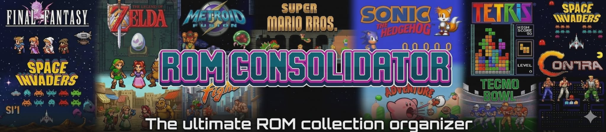

  

# 🧹 ROM Consolidator

**ROM Consolidator** is a fast, intelligent ROM cleaner and organizer that transforms messy game collections into a clean, playable library — automatically selecting the best version of each game.

---

## 🚀 Features

- ✅ Groups duplicate games across folders and archives  
- ✅ Automatically selects the best version using **region + quality scoring**  
- ✅ Removes duplicates and lower-quality versions  
- ✅ Supports `.zip` and `.7z` archives (no manual extraction needed)  
- ✅ Outputs a clean, organized ROM library  
- ✅ Explains *why* each ROM was selected  

---

## 🧠 How It Works

### 🌍 Region Priority

Choose how regions are prioritized:

- English Preferred *(default)*
- USA Only
- Europe Only
- Japan Only
- World Only
- No Filter

**Example (English Preferred):**

---

### ⭐ Quality Scoring

ROMs are scored based on common tags:

**Preferred:**
- `[!]` Verified good dump  
- `(Rev 1+)` Improved revisions  

**Penalized:**
- `[b]` Bad dump  
- `[o]` Overdump  
- `[h]` Hack  
- `[t]` Translation  
- `(beta)`, `(proto)`, `(demo)`  

---

### 🧮 Final Selection

- Region determines priority  
- Quality breaks ties  

---

## 🧾 Filename Styles

Customize how your cleaned library is named:

- Original filename  
- Clean title only  
- Title + Region  
- Title + Region + Revision *(recommended)*  
- Title + Region + Quality  
- Frontend friendly  

Includes a **live preview** before processing.

---

## 📁 Supported Formats

Supports a wide range of systems and formats:

- Cartridge ROMs (`.nes`, `.sfc`, `.gba`, `.gen`, etc.)
- Disc-based (`.iso`, `.bin/.cue`, `.chd`)
- Arcade (`.zip` for MAME / FBNeo — preserved, not extracted)
- Archives (`.zip`, `.7z`)
- Many retro platforms (Nintendo, Sega, Sony, Atari, NEC, and more)

---

## 📊 Results Breakdown

After scanning:

- 🏆 **Unique Results** → Best ROMs kept  
- 🔁 **Duplicates** → Exact matches skipped  
- 📉 **Lower Ranked** → Worse versions removed  
- ⛔ **Unsupported** → Invalid or filtered files  

---

## 🔍 Transparency

- Double-click any result to see **why it was selected**
- Built-in **“How Selection Works”** guide
- Export results to CSV
- Detailed logging

---

## 🧪 Safe Operation

- **Dry Run Mode** → Preview changes without writing files  
- Pre-scan confirmation  
- No DAT files required  

---

## 🎯 Purpose

Most ROM tools focus on building **perfect archival sets** using DAT files.

ROM Consolidator focuses on:

> **“Give me one clean, best version of every game I actually want to play.”**

---

## 🛠 Built With

- C# (.NET Windows Forms)
- SQLite (hash tracking)
- SharpCompress (archive handling)

---

## 📌 Roadmap

- Custom naming templates  
- Network ROM discovery  
- Improved system detection  
- UI/UX enhancements  

---

## ⚠️ Disclaimer

This tool does not provide ROMs.  
You are responsible for ensuring you legally own any content you use.

---

## 👍 Contributing

Suggestions, feedback, and improvements are welcome.  
This project is actively evolving.

---

## ⭐ If you like this project

Consider starring the repo and sharing feedback!
