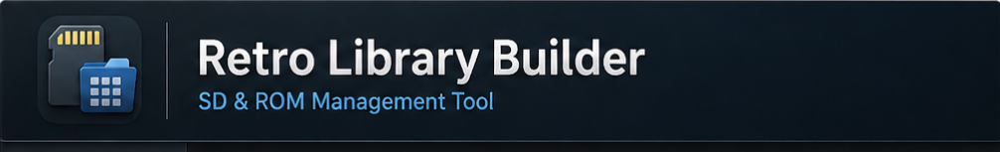

  

# 🎮 Retro Library Builder

**SD & ROM Management Tool**

Retro Library Builder helps you organize, validate, and prepare ROM libraries for use across emulators and handheld systems.

---

## 🚀 Features

* ⚡ **Quick Snapshot**

  * Instantly scan your ROM folder
  * View systems, file counts, and sizes
  * No processing or changes

* 🧠 **Smart System Detection**

  * Detects ROM systems based on files and structure
  * Works with mixed libraries

* 📦 **DAT Integration**

  * Auto-download DAT files
  * Validate ROMs against No-Intro / Redump style databases

* 🗂️ **Library Organization**

  * Clean and structure ROM collections
  * Remove duplicates and bad dumps

* 💾 **SD Card Builder**

  * Prepare SD cards for retro handheld devices

---

## 🖥️ Requirements

* Windows 10 / 11
* .NET Runtime (if required)

---

## ⬇️ Download

Get the latest version from the **Releases** section.

---

## ⚡ Quick Start

1. Launch the app
2. Click **⚡ Quick Snapshot**
3. Select your `ROMS` folder
4. Review your library instantly
5. Run full scan when ready

---

## 🐞 Reporting Issues

Please include:

* Version
* What you did
* What happened
* Screenshot (if possible)

---

## 💡 Roadmap

* Improved MAME support
* Faster scan pipeline
* Better duplicate detection
* UI improvements

---

## 💬 Community

Join the Discord:
👉 https://discord.gg/zCDA8evmyE

---

## ⚠️ Disclaimer

This tool does not provide or distribute ROMs.
Users are responsible for their own data.

---
